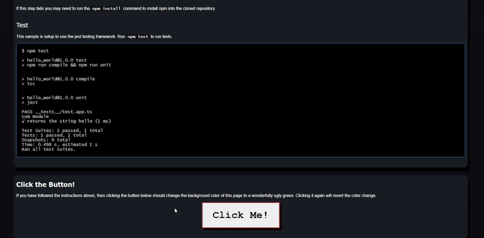

# Typescript Hello world

This is a Hello World program who's purpose it to show TypeScript in the browser and Jest unit testing.

## Files

In this section we'll go over a quick review of all files relevant to TypeScript compilation and Jest
unit testing and overview what each file's purpose is.

### TypeScript

* **app.ts**: The 'main' TypeScript file, contains code that can be compiled to JavaScript
* **package.json**: A rather small yet complex and dubious json file that contains important
metadata about the project that can range from simple names and descriptions to script and dependency
declarations
* **package-lock.json**: A massive json file containing an exact tree of the node_modules
directory and all of it's files so that future installations are able to generate identical trees
* **tsconfig.json**: A json file that configures how TypeScript is compiled into JavaScript
such as what version of JavaScript to compile to, output directory, etc

### Jest

* **\_\_tests\_\_/test.app.ts**: The test TypeScript file, contains the code that Jest will use
to run tests. Must be put in a \_\_tests\_\_ directory to be recognized by Jest</li>
* **jest.config.json**: A json file that configures how Jest will work, such as how many
tests to let fail before stopping or what directory to look for files to test</li>
* **babel.config.js**: A JavaScript file that configures how babel works which works in
conjunction with Jest to run tests. ngl I'm not totally sure what goes on in this file even after looking
at the documentation, but I do know it's needed for Jest to understand the test.app.ts file</li>

## Build

To build the project, run `npm run compile`. The resulting files will be in the build directory

```
$ npm run compile

> hello_world@1.0.0 compile
> tsc

$ ls build
__tests__ app.js app.js.map
```

If this step fails you may need to run the `npm install` command to install npm into the cloned repository.

## Test

This sample is setup to use the jest testing framework. Run `npm test` to run tests.

```
$ npm test

> hello_world@1.0.0 test
> npm run compile && npm run unit


> hello_world@1.0.0 compile
> tsc


> hello_world@1.0.0 unit
> jest

PASS __tests__/test.app.ts
sum module
    √ returns the string hello (1 ms)

Test Suites: 1 passed, 1 total
Tests:       1 passed, 1 total
Snapshots:   0 total
Time:        0.498 s, estimated 1 s
Ran all test suites.
```

## HTML

In helloWorld.html in the 'Click Button' section there is an example on how to import the compiled file
as an ES6 module and attach it to an onclick event. After building the project, open up the website using
some sort of local hosting like [Live Preview](https://marketplace.visualstudio.com/items?itemName=ms-vscode.live-server),
head over to helloWorld.html, and click the button!

